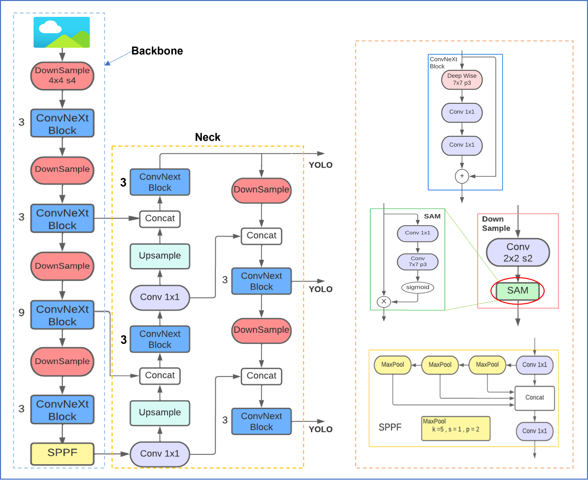
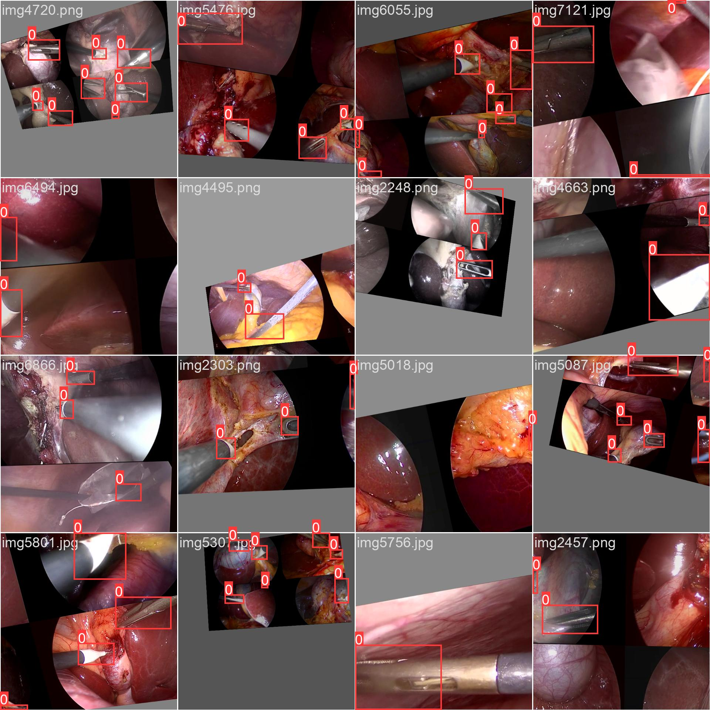

# ConvNeXtSAM

**ConvNeXtSAM** is a deep learning project for object detection and localization of surgical tool tips in minimally invasive surgery (MIS). Built on top of the [YOLOv5](https://github.com/ultralytics/yolov5) implementation by Ultralytics integrating a ConvNeXt backbone enhanced with spatially aware downsampling and multi-scale detection capabilities. The network is trained and evaluated on a manually annotated subset of the **CholecT50** dataset.

---
## 🧠 Model Architecture

The proposed ConvNeXtSAM model builds on the YOLOv5 architecture with significant structural enhancements inspired by ConvNeXt and modern attention mechanisms. Our goal is to improve precision and spatial awareness for tool tip detection in MIS environments while maintaining computational efficiency.

<p align="center">
    
</p>

---

## 🧪 Data Augmentation

Data augmentation was applied to increase the effective size and variability of the training dataset, helping to improve generalization and reduce overfitting — especially important given the limited size and specificity of manually annotated surgical datasets.

We adopted YOLOv5’s built-in data augmentation pipeline and focused primarily on geometric and photometric transformations that simulate realistic camera movements and visual conditions in the operative field. The following augmentations were used:

- 🔀 **Image Translation**: Shifts the image along the x or y axis by a fraction of its dimensions.
- 🌀 **Perspective Transformations**: Mimics changes in viewing angles.
- 🎨 **Color, Saturation, and Brightness Adjustments**: Enhances generalization across varying lighting conditions.
- 🧩 **Mosaic Augmentation**: Combines four different images into one, allowing the model to detect objects in more diverse spatial contexts.

<p align="center">
    
</p>

---

## 📊 Evaluation Results

**ConvNeXtSAM** achieves the best overall performance among all tested models. Of particular importance is its **high recall**, reflecting the model’s strong ability to detect all relevant tool tips with minimal false negatives — a crucial requirement in surgical applications.


<div align="center">

<table>
  <tr>
    <td>

<!-- Markdown content inside HTML: the table -->

<table>
  <tr>
    <th>Method</th>
    <th>P</th>
    <th>R</th>
    <th>mAP<sub>50</sub></th>
    <th>mAP<sub>50:95</sub></th>
    <th>FPS</th>
  </tr>
  <tr>
    <td>YOLOv5</td>
    <td>92.5</td>
    <td>87.8</td>
    <td>92.8</td>
    <td>69.2</td>
    <td>111</td>
  </tr>
  <tr>
    <td>G-YOLOv5</td>
    <td>90.2</td>
    <td>90.3</td>
    <td>93.3</td>
    <td>68.1</td>
    <td>91</td>
  </tr>
  <tr>
    <td>SE-YOLOv5</td>
    <td>92.5</td>
    <td>89.1</td>
    <td>92.8</td>
    <td>69.3</td>
    <td>110</td>
  </tr>
  <tr>
    <td>CSP-SE-ResNeXt</td>
    <td>91.4</td>
    <td>87.9</td>
    <td>91.9</td>
    <td>68.3</td>
    <td><b>125</b></td>
  </tr>
  <tr>
    <td><b>CSP-ConvNeXt</b></td>
    <td><b>92.7</b></td>
    <td>90.8</td>
    <td><b>94.2</b></td>
    <td>69.8</td>
    <td>92</td>
  </tr>
  <tr>
    <td>ConvNeXt</td>
    <td>90.7</td>
    <td>90.7</td>
    <td>93.8</td>
    <td>69.8</td>
    <td>102</td>
  </tr>
  <tr>
    <td><b>ConvNeXtSAM</b></td>
    <td>91.5</td>
    <td><b>92.0</b></td>
    <td><b>94.2</b></td>
    <td><b>70.5</b></td>
    <td>102</td>
  </tr>
</table>

</td>
<td>

<!-- Adjacent image -->


</td>
</tr>
</table>

</div>

---

## ⚙️ Requirements & Setup

To get started, clone the repository and set up your environment:

### 🔁 1. Clone the Repository

```
git clone https://github.com/FrancescoLeni/ConvNeXtSAM.git
cd ConvNeXtSAM
```
```
pip install -r requirements.txt
```

## ⚙️ Models & Data


### 🧠 Pretrained Weights

You can download pretrained model weights from the following link:

🔗 **[Download Pretrained Weights](https://polimi365-my.sharepoint.com/:f:/g/personal/10767238_polimi_it/Ej4ki1wHAZtPr48_lxQEdPoBna0UPR26Cc5civmf0qnWCQ?e=VXw9X5)**  

### 🗂️ Dataset Structure

The model is trained on a subset of the **CholecT50** dataset, manually annotated with bounding boxes following the **YOLO format**. Each image has a corresponding text file containing the annotation.

The dataset directory should be structured as follows:

```
datasets/
└── cholecT50/
├── images/
│ ├── train/
│ ├── val/
│ └── test/
└── labels/
├── train/
├── val/
└── test/
```

### 📄 YOLO Annotation Format

Each `.txt` label file contains one line per object, with the following format:
```
<class_id> <x_center> <y_center> <width> <height>
```
All values are normalized to the range `[0, 1]` relative to image width and height.


### 🚀 Running the Model

to test pretrained model on any data:

```
detect.py --weights <path_to_weights> --source <images_path>
```

To evaluate your model:
```
python val.py --weights <path_to_weights> --data <yaml_to_dataset>
```

in order to train your model:
```
train.py --epochs <num_of_epochs> --batch <batch_size> --data <yaml_to_dataset> --cfg <yaml-to_model> --weights (optional) <pretrained_weights> --hyp <yaml_to_hyperparameters>
```

For more complete information please refer to the official [YOLOv5](https://github.com/ultralytics/yolov5) repository


## 🙏 Acknowledgments

This work builds upon the excellent [YOLOv5](https://github.com/ultralytics/yolov5) implementation by Ultralytics, which provided the foundation for our object detection framework.

We would also like to thank our supervisor **[Mattia Magro](https://github.com/MattiPoli97)** for his valuable guidance, support, and feedback throughout the development of this project.


